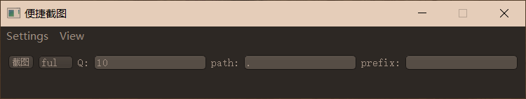
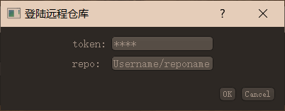
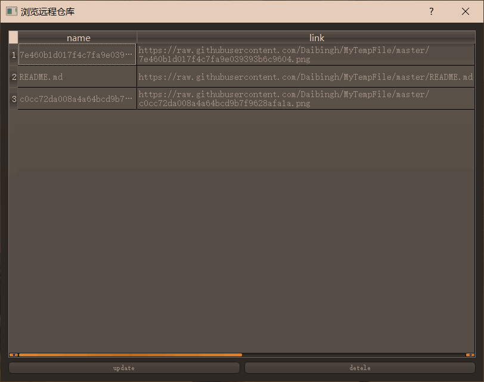

# 便捷截图

## 基本功能

- 截图上传至自己 github 仓库，同时自动导出图片 markdown 引用连接到剪贴板
- 或者，截图保存在本地，同时自动导出图片 markdown 本地引用连接到剪贴板
- 浏览远端仓库文件列表
- 删除远端仓库文件
- shortcut `Ctrl+Shift+M`

主界面：

<center></center>
登陆远程仓库界面

<center></center>
浏览远程仓库界面

<center></center>
图片 markdown 引用连接格式：

```html
<center></center>
```
## requirements

```txt
PyGithub==1.44.1
PyQt5==5.8.2
PyQt5-sip==4.19.14
```

```sh
pip install -r requirements.txt
```

## github token

- [创建 token](https://github.com/settings/tokens) 